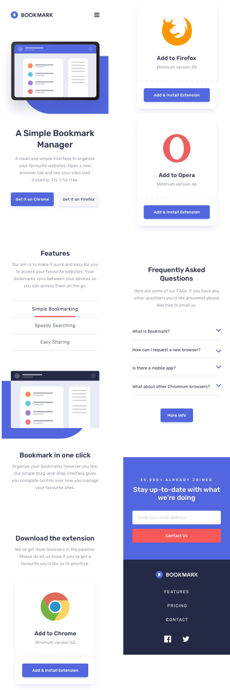

# Tarea Sprint 1.2 Bootstrap & SASS
## 📄 Descripción - Construir una landing page con HTML, Bootstrap y Sass.
Este proyecto consiste en crear una landing page de acuerdo al diseño indicado tanto para escritorio, como móvil y tableta utilizando 
Bootstrap 5 y SASS para generar los estilos CSS.  

  

## 💻 Tecnologías Utilizadas
* HTML
* CSS
* JavaScript
* Boostrap 5
* Sass

## 📋 Requisitos
* Node.js 
* Editor de codigo(Visual Studio Code)

## 🛠️ Instalación
Para Visualisar el proyecto desde github pages:  
[Bookmark](https://mgonzalesdev.github.io/1-Maquetacion-Nivel1/) 

Para ejecutarlo de manera local:
* Descarga el codigo del branch main.
* Verificar que tienes instalado node.js y que npm este iniciado, esto permitira la instalación del paquete de boostrap.
* Instalar boostrap v5.3: desde la interfaz de línea de comandos, dirigirse al directorio del proyecto y ejecutar "npm install bootstrap" esto descargará el paquete node_modules en el proyecto.

## ▶️ Ejecución
Ejecución de manera local:
* Acceder a la carpeta del proyecto, para previsualizar la página en un navegador abre el archivo index.html
* Otra opción para visualizar es utilizando la extension "Live server" de Visual Studio.
