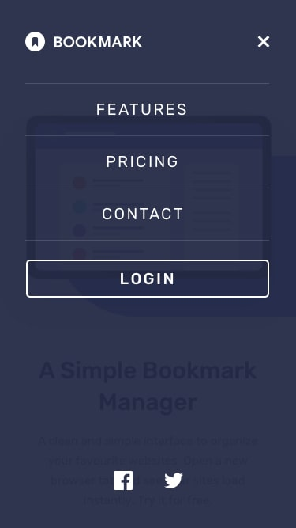

# Tarea 1.1: Maquetación Flexbox
## 📄 Descripción
Construir una landing page HTML y CSS con Flex
Este proyecto consiste en realizar un Layout que debe funcionar tanto en escritorio, como móvil y tableta usando Flexbox.  

  

## 💻 Tecnologías Utilizadas
* HTML
* CSS
* JavaScript

## 📋 Requisitos
Navegador  
Editor de codigo(Visual Studio Code)

## 🛠️ Instalación
Descarga el codigo del branch master.  
Abrir el proyecto con un editor de codigo. 

## ▶️ Ejecución
Acceder a la carpeta del proyecto.  
Para previsualizar la pagina en un navegador abre el archivo index.html.  
Otra opcion para visualizar es utilizando la extension "Live server" de Visual Studio.
